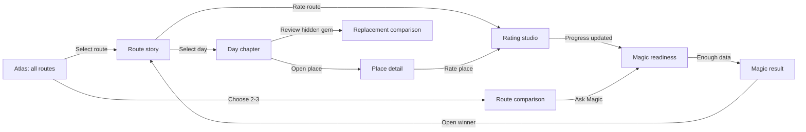

# The Detour Atlas

## UI vision and implementation directive for Luna

**Document status:** implementation source of truth for the first complete UI build  
**Workspace:** `/Users/sheluvspaco/Desktop/trip advisor`  
**Trip dates represented by the current data:** October 4–14, 2026, with departure/airport obligations on October 15  
**Current content:** 10 Boston round-trip candidates plus 1 premium Boston-to-Houston one-way candidate

---

## 0. Luna: read this first

This product must feel like opening a cinematic travel atlas and then discovering that it is also an exact decision instrument. It is not a conventional trip dashboard, a list of tourist cards, or a Google Maps imitation with a sidebar attached. The emotional job is to make four friends *feel* each possible holiday. The functional job is to let them understand, compare, rate, and confidently choose one route without hiding the cost, weather, driving, or operational compromises.

Build the experience from the existing route packages. Do not replace researched content with mock data, do not invent live traffic or forecasts, and do not silently alter the itinerary. Use the real coordinates, route geometry, times, planning ranges, descriptions, best-fit notes, fallbacks, sources, replacement options, and local images that are already present.

The non-negotiables are:

1. The opening view is a full-screen, globe-like map of the continental United States with Boston as the common hub and all eleven candidate routes visible in their assigned colors.
2. Hover, keyboard focus, and touch selection must isolate a route. Activating one must create a cinematic fit-to-route transition into a map-led itinerary workspace.
3. Every day must make the bed-to-bed journey legible: date, sleep city, route, miles, baseline driving time, planning range, traffic/operational risk, stops, weather in Celsius, lodging-area guidance, and fallback.
4. Every researched place must use its real three-image set and be independently rateable by Paco, Viki, Gora, and Stivka.
5. Every overnight city/stay must also be rateable through an app-derived stay chapter; the source datasets currently store `sleep_city` rather than a separate city entity, so the adapter described later must bridge that gap without fabricating facts.
6. Each day's hidden gem is a **replacement**, never an extra stop. Its geometry, miles, time, and score membership change only after explicit confirmation.
7. The `Magic` result is transparent, reproducible, and based on equal traveler votes. It must explain the winner and show each person's own favorite.
8. Route 11 is visibly and structurally different: it is a premium one-way route ending in Houston, it does not return to Boston, and it contains authorized driving-cap exceptions. Never present it as a normal loop.
9. There is no Google Maps, Google Directions, Google Places, or live weather dependency in v1. Map and weather facts are hard-coded from the route packages. The basemap renderer may fetch map tiles, but route geometry and trip facts must remain local and provider-independent.
10. The UI must be beautiful at 1440 px desktop width, fully usable on a laptop, and genuinely re-composed for mobile. It must not merely shrink the desktop layout.

If aesthetic taste and clarity ever conflict, protect clarity. If animation and responsiveness conflict, protect responsiveness. If a visual treatment suggests data is more current or exact than it is, protect truth.

---

## 1. Product definition

### 1.1 The product in one sentence

An immersive, map-first voting room where four friends explore eleven highly researched road-trip stories, inspect every day and stop, test one-for-one hidden-gem swaps, compare tradeoffs, and use an explainable group score to choose the holiday.

### 1.2 Primary jobs to be done

The app must let the group answer these questions in this order:

1. **What are our route options?**
2. **What would each route actually feel like over eleven days?**
3. **How much driving happens each day, and where are the risky days?**
4. **What will we see, and is there enough for each person?**
5. **What can replace an anchor if the group prefers something stranger or more fitting?**
6. **How do two or three finalists compare under the same criteria?**
7. **What does each person think independently?**
8. **Which route wins when every vote and practical constraint is counted fairly?**

### 1.3 Audience and usage context

This is initially a private, shared-device decision tool for four friends. There is no account system in v1. The likely use is a large laptop or desktop connected to a television while the group discusses the routes, followed by individual rating turns on the same device. Mobile support is still required for personal review and rating.

The travelers are:

| Data ID | Display name | Product-relevant lens |
|---|---|---|
| `sheluvspaco` | Paco / SheLuvsPaco | Planner and group-harmony lens; wants the entire trip to work for everyone. |
| `viki` | Viki | Photogenic nature and architecture, unusual experiences, cafés, shopping/outlets, and selective nightlife. |
| `gora` | Gora | Serious history, evidence and under-told stories, strength/combat culture, nature resets, and social nights. |
| `stivka` | Stivka | Orthodox faith, churches, nature, relaxed social experiences, heavy metal and rock. |

Do not turn these into caricatures. Use the names, initials, and the researched `best_fit_note`. Do not use gendered icons. `researcher_person_fit` is a recommendation signal, never a vote and never a prefilled rating.

### 1.4 Trip constraints the interface must keep visible

- Four travelers in two cars following the same route.
- The road trip leaves Boston on October 4 after the Nantucket–Hyannis–Boston transfer; there is no Boston sleep on October 4.
- Standard routes return to Boston on October 14 and protect October 15 airport obligations.
- Standard bed-to-bed baseline driving cap is 210 minutes. Planning ranges can exceed that because they include risk buffers rather than a live forecast.
- Route 11 has a separate disclosed 330-minute baseline ceiling and does not return to Boston.
- Lodging guidance is a strong area suggestion, not a booking engine. Preferred setup is two rooms: one room with one bed and one room with two beds. Safety, cleanliness, comfort, parking, and exact bed inventory matter.
- The controllable budget target is approximately $1,500 per person and excludes lodging, rental cars, fuel, nightlife, and personal shopping.
- Weather is shown in Celsius. Current values are historical normals, not forecasts, and have only a 5% Magic weight.
- Athletic/adrenaline anchors are intentionally rare. Nightlife is selective, with a maximum of four major nights.

---

## 2. Existing data inventory and truth hierarchy

### 2.1 Canonical entry point

Always begin with `dataset/manifest.json`. Do not reconstruct package paths from a slug. Each manifest entry provides explicit paths for route facts, places, images, map geometry, replacement geometry, sources, and decisions.

The browser must never load every raw file at startup. A build-time adapter must turn the canonical packages into compact app-facing artifacts.

### 2.2 Route inventory

| Route | Name | Type | Color | Baseline miles | Places | Images |
|---|---|---:|---:|---:|---:|---:|
| 01 | The Gilded Coast & Capital Loop | Boston loop | `#FF5A36` | 1,144.5 | 51 | 153 |
| 02 | The Falls, Fire & Clockwork Loop | Boston loop | `#6C5CE7` | 1,281.8 | 51 | 153 |
| 03 | The Wild Shore, Rockets & Folklore Loop | Boston loop | `#00A8A8` | 1,415.6 | 50 | 150 |
| 04 | The Trolls, Moon Rocks & Curiosity Coast Loop | Boston loop | `#F59E0B` | 1,063.4 | 48 | 144 |
| 05 | The Coal Veins, Caverns & Blue Ridge Secrets Loop | Boston loop | `#E11D48` | 1,412.2 | 42 | 126 |
| 06 | The Mothman, Steel Cathedrals & Cabinet of Evidence Loop | Boston loop | `#2563EB` | 1,669.9 | 33 | 99 |
| 07 | The Kazoos, Rock & Mechanical Dreams Loop | Boston loop | `#F97316` | 1,497.0 | 29 | 87 |
| 08 | The Lemurs, Stone Bridges & Mechanical Dreams Loop | Boston loop | `#16A34A` | 1,620.1 | 26 | 78 |
| 09 | The Kaleidoscopes, Scripture Stones & Secret Machines Loop | Boston loop | `#A855F7` | 1,677.3 | 25 | 75 |
| 10 | The Temples, Follies & Working Machines Loop | Boston loop | `#DB2777` | 1,527.9 | 24 | 72 |
| 11 | The Hidden Halls, Brass Nights & Moonshot Run | Premium one-way | `#B88917` | 2,141.3 | 28 | 84 |

Current total: **11 routes, 407 place records, and 1,221 referenced carousel images**.

### 2.3 Package files and their UI roles

| File | Use in the app |
|---|---|
| `route.json` | Primary route metadata, constraints, eleven days, schedules, drive legs, weather, lodging areas, budget, replacement declarations, and rating shells. |
| `places.json` | Place copy, categories, coordinates, duration, hours, cost, reservations, best-fit notes, image IDs, and inclusion state. |
| `images.json` | Local image paths, alt text, creator, license, source, coverage, and public-use status. |
| `route.geojson` | Map-ready drive legs, place points, route nodes, and replacement features. Filter by `properties.feature_kind`. |
| `route-geometry.json` | Complete node lookup and measured daily geometry; particularly useful for lodging-zone coordinates. |
| `replacement-geometry.json` | Eleven measured replacement variants, their leg geometry, and time/mileage deltas. |
| `sources.json` | Official/research source index for verification drawers and operational links. |
| `route-decisions.json` | Why major routing choices were accepted/rejected. Use in an optional “Why this route works” methodology panel. |
| `weather-normals.json` | Weather provenance and supporting normal records; day-level display values already live in `route.json`. |
| `README.md` | Human-readable route summary and current warnings. Useful to Luna during QA; it is not an app data source. |
| `research-raw.json`, `place-seed.json` | Build/research provenance only. Never ship or render them in the client. |

### 2.4 Truth priority

When fields disagree, follow this order:

1. `dataset/manifest.json` for package registration and paths.
2. The package's `route.json` for itinerary and scoring facts.
3. `places.json` and `images.json` for place and media facts.
4. `replacement-geometry.json` for swap measurements.
5. `route.geojson` for renderable map features.
6. `route-geometry.json` for node lookup and diagnostics.
7. `sources.json` and `route-decisions.json` for provenance.
8. README prose only as a human cross-check.

Never make the UI silently “fix” researched facts. If validation finds a conflict, fail the generated artifact for that route and show a precise build error.

### 2.5 Data caveats the UI must communicate honestly

- OSRM times are road-network baselines and contain **no live traffic**.
- Planning ranges are conservative planning bands, not live traffic predictions.
- NOAA values are historical climate normals, not a 2026 forecast.
- Hours, prices, reservations, and events can change. Preserve their status and notes.
- Lodging is an area recommendation only; no hotel availability or safety guarantee is live.
- The app has no ambient nearby-POI search in v1. It should show the researched places rather than suggest stale OSM cafés or pretend to have Google Places coverage.
- The source image library is suitable for a private prototype. Of the 1,221 referenced images, 306 are flagged `production_usable: false` and require permission or replacement before public deployment. The build must have a public-rights mode described later.

---

## 3. Experience north star

### 3.1 Working product name

Use **The Detour Atlas** as the working name. It communicates that overlooked places and alternate paths are the heart of the product. Keep the name in a single configuration constant so it can be changed later without searching the component tree.

Suggested lockup:

> THE DETOUR ATLAS  
> Boston · October 4–14, 2026 · Four travelers

### 3.2 Emotional direction

The experience should combine:

- the quiet authority of a beautifully printed road atlas;
- the drama and imagery of a premium travel documentary;
- the precision of a mission-control planning table;
- the intimacy of four friends spreading photographs and route notes across one table.

It should feel crafted, warm, mysterious, and exact. It should not look like a corporate SaaS dashboard, a travel-booking marketplace, a generic template, a sci-fi HUD, or a neon AI product.

### 3.3 The visual metaphor

The map is the shared table. Route lines are colored threads. Day chapters are field notes. Images are evidence of what the trip might feel like. Ratings are pencil marks from four equal voices. Magic is the moment the threads are pulled together and one route becomes the clearest shared story.

### 3.4 Design principles

1. **Map first, content in dialogue with it.** Selecting or scrolling content must change the map; selecting the map must change content.
2. **Emotion before density, precision before decoration.** Lead with a strong image and title, then reveal exact operations progressively.
3. **Every color has a job.** Route colors identify candidates. Gold identifies Magic/premium emphasis. Status colors identify risk. Never mix those meanings.
4. **The itinerary is a story, not a spreadsheet.** Days are chapters with rhythm: drive, encounter, reset, sleep.
5. **No hidden compromises.** Cap exceptions, rights limitations, weather type, and non-live timing are visible at the point where they matter.
6. **Voting must stay impartial.** Research fit is guidance; actual ratings remain empty until a traveler chooses.
7. **Alternatives replace; they do not accumulate.** The UI language and calculations must enforce this rule.
8. **The final answer must be explainable.** Magic is a transparent calculation wrapped in a memorable reveal, not a mysterious black box.

---

## 4. Information architecture and URL state

This is a private, highly interactive workspace, so keep one persistent app shell and one persistent map instance. Encode meaningful view state in the URL so browser back/forward and shared links still work.

Recommended URL forms:

```text
/?view=atlas
/?route=route-01
/?route=route-01&day=4
/?route=route-01&day=4&place=tenement-museum
/?view=compare&routes=route-01,route-08
/?view=ratings&route=route-01&traveler=viki
/?view=magic
```

Do not make camera coordinates part of the public URL. Preserve them in session state. On a direct deep link, derive the correct camera from the selected route/day/place.

### 4.1 Primary view states



### 4.2 Persistent global navigation

The global shell contains:

- product wordmark and trip date;
- `Atlas`;
- `Compare` with a live count, e.g. `Compare · 2`;
- `Ratings` with overall completion, e.g. `Ratings · 41%`;
- the four-person traveler switcher;
- `Magic` with readiness, e.g. `Magic · 63% ready`;
- a compact method/info control.

On desktop the shell is a restrained top bar over the map. On mobile it becomes a top strip plus the bottom-sheet navigation. Avoid a large conventional navigation header.

The Magic control is never a dead disabled button. Before completion, activating it opens the readiness view and tells the group exactly what remains.

---

## 5. Screen and interaction specifications

## 5.1 Opening atlas

### Purpose

Create immediate wonder, establish Boston as the common origin, make eleven alternatives understandable, and let the group enter any route without reading a list first.

### Composition

- Full viewport MapLibre canvas.
- Globe projection at continental-US scale with restrained atmospheric depth.
- Deep night-ocean and graphite land treatment; state boundaries and major cities are visible but quiet.
- Boston is a warm ivory/brass hub marker with a subtle pulse on first load only.
- All baseline route legs are visible in manifest colors.
- A compact, edge-mounted **Route Index** lists `01` through `11`. It is collapsed by default to preserve the globe and expands on hover, keyboard focus, or tap.
- A route preview plate appears in the lower-left safe area when a route is focused.
- Global controls sit above the map with strong contrast and minimal visual weight.

### Route Index behavior

Collapsed desktop width: approximately 72 px. Expanded width: 320–360 px. The expanded row contains route number, short name, type, miles, rating progress, and a small line sample.

It is the precise selection mechanism when map lines overlap. Map line clicking remains supported, but the index must never be treated as secondary accessibility fallback.

### Default map line treatment

- Baseline route line: 2.5–3 px at 55–70% opacity depending on local overlap.
- Dark or warm-ivory casing below every route line to preserve separation from the basemap.
- Selected/focused line: 6 px route color plus 10–12 px casing/soft halo.
- Unselected lines during focus: 12–20% opacity.
- Transparent 18–24 px interaction layer above visible lines.
- Route number badges at one representative non-Boston section of each route. Color is never the only identifier.
- If overview routes share exactly the same road, a small deterministic screen-space `line-offset` may fan them by a few pixels in atlas mode only. Reset offsets to zero in detail mode so geometry is exact.

### Overlap click behavior

Query a small pointer/touch box, not a single pixel. If multiple route features are under the pointer, open a compact “Routes through here” chooser listing their numbers and names. Never arbitrarily select whichever layer happens to render on top.

### Focus preview

The preview plate shows:

- route number and name;
- `Boston loop` or `Premium one-way · ends Houston`;
- route summary excerpt;
- eleven days;
- baseline miles;
- total baseline drive time;
- longest baseline day and cap state;
- expected high/low range, explicitly labeled `Climate normal`;
- controllable per-person budget range;
- category mix rendered as three to five plain-language themes;
- current rating completion and current group score if available;
- `Open route` and `Add to compare` actions.

Derive the metrics from the package. Do not manually author separate route-card facts.

After a route remains focused for a short intent delay, reveal a narrow three-image filmstrip. Derive it from three distinct selected anchor places near the beginning, middle, and end of the route, using each place's first rights-eligible image. Emit those `teaserImageIds` during the build so the client does not search the full image index at runtime. If a rights mode cannot supply three distinct images, render the available images plus a designed route-number panel rather than duplicating one photograph.

### Opening animation

On first visit only:

1. The globe resolves from a dark field.
2. Boston appears.
3. Route lines draw outward in a restrained 700–1,000 ms sequence.
4. The Route Index and copy fade in.

The sequence must be skippable by any interaction and absent under `prefers-reduced-motion`. Do not replay it on every return to the atlas.

### Selecting a route

Activation should:

1. lock the selected route;
2. dim all others;
3. smoothly fit the selected bounds with padding for the upcoming information panel;
4. change from globe/atlas presentation to route-detail map presentation;
5. draw the route in travel order;
6. reveal the detail workspace while preserving the map instance.

The transition target is roughly 700–900 ms. It should feel deliberate, not slow.

---

## 5.2 Route detail workspace

### Desktop layout

At widths above roughly 1100 px:

- map: 56–62% of the viewport, fixed;
- itinerary/story panel: 38–44%, independently scrollable;
- compact eleven-node day rail inside the story panel;
- global bar over both regions;
- map padding always accounts for the open panel.

At 1440 × 900, the user should see the selected route clearly and at least the opening half of the active day chapter without scrolling.

### Route header

The top of the story panel is a large editorial introduction, not a stack of metric cards. It includes:

- route number, name, and type;
- one-line route direction;
- route summary;
- date range and destination/return state;
- a single horizontal metric strip for days, miles, baseline drive, budget, weather comfort, and rating completion;
- prominent one-way/cap-exception warning for Route 11;
- `Compare`, `Start rating`, and `Route methodology` actions;
- an eleven-day weather ribbon using high/low bars and precipitation-normal markers.

Use the route color as a rule, number stamp, and map identity—not as a large colored background.

### Day rail

The rail contains eleven numbered stops. Each item communicates:

- day number;
- short date;
- sleep city abbreviation;
- drive state icon: comfortable, near cap, gated, or authorized exception;
- rating completion dot.

Clicking a rail item scrolls the corresponding day chapter and updates the map. Scrolling chapters updates the rail and map through `IntersectionObserver`. Guard the two-way synchronization so programmatic scrolling does not create feedback loops.

### Map state in route detail

- Entire route remains visible as a quiet context line.
- Active day's path is strong and all other days are muted.
- Completed/earlier day legs may use slightly lower opacity; do not imply actual trip progress unless the app later gains a travel mode.
- Active schedule places are visible and numbered in chronological order.
- Overnight/lodging-zone marker uses a bed/house symbol and is visually different from an attraction.
- Driving legs receive midpoint labels such as `78 mi · 1h 24m` at appropriate zoom.
- Selecting a leg opens its exact from/to, baseline, planning band, risk, and source disclaimer.
- Point clustering is acceptable only in atlas overview. In a selected day, all relevant points must remain individually discoverable.

### No route selected / loading

Keep the map visible. Show a cartographic skeleton in the story panel with route-colored rules; do not blank the viewport or use a generic centered spinner. A route-load error must name the route and file stage, offer retry, and preserve navigation back to the atlas.

---

## 5.3 Day chapter

Each day should read as a designed travel chapter with progressively disclosed precision.

### Above-the-fold day anatomy

1. `DAY 04 · WED 07 OCT`
2. Day title using `day.title ?? day.theme`.
3. Origin → sleep city line.
4. Weather lockup: normal high/low in °C, precipitation normal, comfort score, and `Historical normal · not forecast` label.
5. Drive strip: total miles, OSRM baseline, planning range, traffic/operational risk, and cap state.
6. Time-zone transition if present.
7. A narrative schedule timeline.

### Schedule timeline

Render schedule items in chronological order. Each item has:

- start/end;
- sequence number matching the map marker;
- place name and city;
- anchor/supporting/optional indicator;
- duration;
- reservation state in plain language;
- compact category markers;
- group average and active person's rating if available;
- a real image crop;
- `Open place`.

Do not turn every schedule item into an equally heavy card. Anchors receive a richer image treatment; supporting items can be more compact rows; logistics are quiet utility rows.

### Driving-leg treatment

Between schedule entries, use a clearly different connector block:

> Providence → Newport  
> 39.2 miles · 1h 05m road baseline  
> Plan 1h 15m–1h 35m · Medium traffic risk

Required language rules:

- Say `Road baseline`, never `ETA`, unless a future live provider is active.
- Say `Plan X–Y`, never imply it is calculated live.
- Display ferry or other modes with their own icon and operational-risk wording.
- Use `traffic_risk: schedule-and-weather` as `Schedule/weather dependent`, not as road congestion.
- Show a tooltip or info affordance explaining OSRM once, then keep labels concise.

### Lodging-area section

Near the chapter end, show:

- preferred area;
- fallback area;
- exact two-room setup reminder;
- parking/safety/check-in notes;
- `Strong suggestion · verify manually` label.

Do not display invented hotel names, live prices, star classifications, or availability.

### Fallback section

Falling behind is part of the route design. Present the fallback as a calm, useful `If the day slips` note. Make the cut order explicit where the source does. Never bury it in a tooltip.

### Day-level actions

- `Focus this day on map`
- `Rate this stop`
- `Review hidden-gem swap`
- `Open day in Rating Studio`
- `Copy coordinates/plan` as a secondary utility

---

## 5.4 Stay/city chapter

The user requires cities and stop locations to be rateable, but the canonical package currently represents overnight cities as `day.sleep_city` strings rather than `places` records. Build a deterministic app-facing `StayChapter` entity; do not write it back into the canonical research package at runtime.

### Derivation rule

For each route, group days by normalized `sleep_city` and create:

```ts
type StayChapter = {
  id: `${RouteId}:stay:${string}`
  routeId: RouteId
  name: string
  dayNumbers: number[]
  coordinates: [number, number]
  chapterTitles: string[]
  childPlaceIds: string[]
  heroImageIds: string[]
  lodgingGuidance: Array<Day['lodging']>
  includedInMagicScore: true
}
```

Derive its coordinates from the corresponding lodging node in `route-geometry.json`. Prefer a day route node ending in `-lodging`; if none exists, use the final leg endpoint; only as a last resort use the centroid of the day's scheduled places and record a build warning.

Use `day.title`/`day.theme` as the chapter synopsis. Select up to three images from scheduled places in that city/day, preserving their original captions and credits. Label them `Experiences in this route chapter`; do not claim that an attraction close-up is a general city view.

If the same city has two nights, one shared stay rating is shown in both day chapters. This prevents duplicate ratings of New York or New Orleans while still showing both daily stories.

### Stay chapter UI

It should include:

- city and state;
- nights/days on this route;
- route chapter title(s);
- a compact three-image mosaic or carousel drawn from child places;
- preferred lodging areas;
- category mix and scheduled place count;
- one equal rating slot for each traveler;
- group average after votes exist.

Stay ratings join place ratings inside the 45% `attraction_and_stop_ratings` component.

---

## 5.5 Place detail and image carousel

### Opening behavior

Selecting a place from the map or itinerary opens a detail surface without losing route/day context:

- desktop: a large overlay sheet within the story side, with map still visible;
- mobile: a nearly full-height bottom sheet;
- optional full-screen media mode for images.

The map centers the place with panel-aware padding and highlights its marker.

### Required content hierarchy

1. Three-image carousel or editorial mosaic.
2. Place name, city/state, and exact category language.
3. Short `summary`.
4. `Why it earns the stop` using `why_go`.
5. Subtle, human `Best fit` note using `best_fit_note`.
6. Duration, cost, hours/status, reservation action, visit date, and accessibility/physical-effort note when known.
7. Coordinates with copy control.
8. Source links in a collapsed verification area.
9. Active traveler rating control and group result.

### Carousel requirements

- Exactly respect `place.image_ids` order.
- Resolve through `images.json`, never by filename guessing.
- No autoplay.
- Previous/next buttons, swipe, arrow keys, and thumbnail/scrubber state.
- Show `1 / 3`.
- Use dataset `alt` text.
- Caption/credit/license is available through an `Image details` affordance; credit remains visible in full-screen media mode.
- Contextual images must say `Local context` or the more precise coverage label rather than implying exact-place coverage.
- Preload only the next slide, not every image in the route.
- Preserve focal content with `object-fit: cover` in preview and `contain` in full-screen mode.
- Never show a broken image icon; use a route-colored cartographic fallback with place name and a precise warning in development.

### Best-fit language

Keep the note understated beneath the main description. Example treatment:

> **Likely group fit**  
> Best for Viki's visual curiosity and Paco's goal of beginning with an easy group win.

Do not present researcher fit numbers next to ratings by default. If exposed at all, put them inside `Why it fits the group` and label them `research match`, not `score`.

---

## 5.6 Hidden-gem replacement flow

Every route has one measured replacement option per day. This is one of the product's most distinctive interactions and should feel like rerouting a story, not toggling a checkbox.

### Entry point

Each day ends with a restrained `There is another way` band showing the replacement name, one image, and its time/mileage delta. Activating it opens a two-column comparison.

### Comparison content

**Current day anchor(s)** versus **Hidden-gem replacement**:

- image and description;
- what is removed (`replaces_place_ids` can contain more than one place);
- what is inserted;
- traveler fit;
- categories;
- visit duration;
- hours/reservation/cost confidence;
- current versus replacement total miles;
- current versus replacement baseline minutes;
- signed delta in miles and minutes;
- cap result;
- map geometry preview;
- effect on current rating completion and provisional Magic score.

The alternative geometry is a dashed line until confirmed. The current geometry remains solid. Use the same map camera for comparison.

### Confirmation rules

On `Use this alternative`:

1. Store the selected replacement ID for that route/day.
2. Remove every replaced place from the chosen itinerary and from Magic membership.
3. Insert the replacement place and include it in Magic membership.
4. Replace that day's geometry and displayed totals with the measured variant.
5. Preserve ratings on removed anchors so they return if the swap is undone, but exclude them from calculations while removed.
6. Update route comparison and Magic previews immediately.
7. Offer one-click `Undo`.

Never append the replacement to the existing schedule. If the data lacks an exact replacement start/end time, derive a clearly labeled `replacement window` from the span of the removed schedule items. Do not claim a minute-perfect revised timetable.

---

## 5.7 Rating experience

Ratings appear in context on route, stay, and place surfaces, but the product also needs a fast dedicated Rating Studio. There are 407 place records and four voters; contextual-only rating would make completion unreasonably tedious.

### Rating scale

- 1 to 5 stars.
- 0.5 increments.
- No zero rating; unrated is `null`.
- Each traveler has exactly equal weight.
- Provide `Clear rating` and immediate undo.

### Active traveler switcher

Use initials plus names: `P Paco`, `V Viki`, `G Gora`, `S Stivka`. Give each traveler a stable accent, but always include the name/initial so color is not the identifier.

Switching traveler changes whose empty/personal rating controls are active. It must never overwrite another person's rating.

### Bias-aware reveal

Before the active traveler rates an entity, hide the numeric group average by default and say `Group result appears after your vote`. After they rate, reveal the average and distribution. Provide a setting to turn this behavior off if the group explicitly wants open voting.

### Accessible star control

Implement the control as a nine-option radio group representing 1.0 through 5.0 in 0.5 steps. Pointer position can paint half stars, while keyboard left/right changes by 0.5 and Home/End jumps to bounds. Announce, for example, `Viki rated 4.5 out of 5`.

Do not implement five unlabeled SVG click targets with mouse-only half-star logic.

### Contextual rating blocks

Place/stay cards show:

- active traveler control;
- four compact traveler slots;
- group average and count after reveal;
- `Included in Magic` or `Alternative · excluded until selected` status.

Route conclusion shows five route-level rating dimensions for each traveler:

1. Overall gut rating.
2. Driving comfort.
3. Overall excitement/uniqueness.
4. Cost/value.
5. Expected weather.

### Rating Studio

The Studio is a distraction-controlled queue with one dominant entity at a time:

- route and traveler selectors;
- progress: person, route, and total;
- filters: unrated, places, stays, route dimensions, selected itinerary only, alternatives;
- image, name, concise summary, category, day, and best-fit note;
- large rating control;
- `Previous`, `Skip for now`, `Next unrated`;
- keyboard shortcuts: `1`–`5` for whole stars, arrows for half steps, `Enter` to confirm/advance;
- a compact queue rail showing day grouping;
- `Pass to Viki/Gora/Stivka` action after one person's route queue is complete.

Alternatives remain rateable because the group may want to evaluate them, but they do not count in Magic unless selected. Make that distinction visible.

### Progress model

Show separate progress values:

- `Route browsing complete` is not needed; do not gamify scrolling.
- `Selected stops rated`.
- `Stay chapters rated`.
- `Route dimensions rated`.
- `Alternatives rated` as optional progress.
- `Magic readiness` counts only required selected entities and route dimensions.

---

## 5.8 Route comparison

Allow two or three routes. Four columns become illegible and encourage shallow scanning.

### Layout

- Desktop: shared comparison map above or to the left, standardized comparison columns to the right/below.
- Mobile: sticky route selector plus one metric row at a time; never squeeze three desktop columns onto the screen.
- Route colors remain identity accents.

### Required comparison rows

- trip type and endpoint;
- return to Boston state;
- total miles;
- total baseline driving time;
- longest baseline day;
- number of near-cap/gated/exception days;
- average daily miles;
- number of unique overnight cities;
- planned major nights out;
- core attraction/stay count currently feeding Magic;
- normalized category mix;
- controllable budget range per person;
- daily high/low climate-normal range;
- average weather comfort normal;
- current group Magic score or readiness;
- each person's current personal score;
- most divisive and most universally liked rated stop, when enough votes exist;
- incomplete-rating warning.

### Premium-route fairness

Route 11 must carry a persistent `Premium one-way` band. Its 330-minute ceiling and Houston ending stay visible in comparison. Add an `All candidates` / `Standard Boston loops` scope toggle so the group can see both the full winner and the winner among rule-comparable loops.

### Difference-first behavior

Give users a `Show differences only` control. Keep metric definitions in tooltips and use the same rounding rules for all routes.

---

## 5.9 Magic readiness and result

Magic is the payoff, not a decorative button. It has three states.

### State A: insufficient

There is not enough comparable input. Show:

- total readiness percentage;
- missing votes by person and route;
- the shortest path to a valid provisional result;
- `Continue rating` deep links;
- no fabricated winner.

### State B: provisional

At least two routes contain data for every weighted component, but required ratings remain incomplete. Show a provisional winner with:

- `Provisional` label;
- confidence/completion percentage;
- missing-vote warning;
- candidate coverage;
- explanation that available votes are equally weighted but incomplete coverage can move the result.

### State C: final

All required selected places, stay chapters, and route dimensions across the chosen comparison scope have four traveler ratings. The reveal can be cinematic:

1. Globe/map darkens slightly.
2. Candidate lines brighten in order of final score.
3. Non-winners settle back.
4. Winner retains its route color and gains a restrained brass halo; do not recolor it gold and destroy route identity.
5. The result panel rises with the exact score and explanation.

Honor reduced motion with an immediate crossfade.

### Final result content

- winner name, route number, type, and final score out of 5;
- weighted component breakdown;
- why it won in plain language;
- strongest and weakest component;
- most universally loved place/stay;
- most divisive place/stay;
- driving and cost tradeoff;
- weather contribution, visibly small;
- each person's highest-scoring route;
- runner-up and margin;
- `Open winning route`, `Compare with runner-up`, and `View the math` actions.

The prose must be generated from deterministic score facts and templates, not an online LLM call.

---

## 6. Exact scoring specification

The canonical weights are fixed:

| Component | Weight |
|---|---:|
| Attraction and stop ratings | 45% |
| Excitement and uniqueness | 20% |
| Driving comfort | 15% |
| Traveler fairness | 10% |
| Cost and value | 5% |
| Expected weather | 5% |

All component values are on a 1–5 scale. Keep full precision internally; round only for display.

### 6.1 Selected itinerary membership

For a route:

```text
selectedPlaces = core_place_ids
  - every replaces_place_id from a confirmed replacement
  + every confirmed replacement_place_id

selectedStays = all derived unique StayChapter entities for the route
```

Optional and unselected alternative places can be rated but are excluded.

### 6.2 Attraction and stop component

Calculate an equal-voter mean for each selected entity, then an equal-entity mean:

```text
entityMean(entity) = mean(Paco, Viki, Gora, Stivka ratings)

attractionAndStop = mean(
  entityMean(each selected place),
  entityMean(each selected stay)
)
```

This prevents routes with more stops from automatically winning through vote volume, while still requiring every selected experience to be considered.

For provisional scoring, use available traveler values only, but retain coverage metadata for every entity and make missingness prominent.

### 6.3 Route dimension components

```text
excitement = mean(all four overall_excitement_ratings)
drivingComfort = mean(all four driving_comfort_ratings)
costAndValue = mean(all four cost_value_ratings)
expectedWeather = mean(all four weather_ratings)
```

Do not substitute dataset `weather.comfort_score` for user weather ratings. The normal comfort score is context; the four ratings are the vote.

### 6.4 Traveler fairness

Fairness measures whether the route leaves one person behind, not whether everyone liked it in absolute terms.

For each traveler, calculate their mean across all selected places and stays:

```text
personalExperienceMean(t) = mean(t's ratings for all selected places and stays)
spread = max(personalExperienceMean) - min(personalExperienceMean)
travelerFairness = clamp(5 - spread, 1, 5)
```

Examples:

- Personal means `4.4, 4.3, 4.5, 4.4` → fairness `4.8`.
- Personal means `4.8, 4.1, 3.6, 4.4` → fairness `3.8`.
- Everyone equally dislikes a route → high fairness but low attraction score, which is correct: equality and quality are separate questions.

Only call fairness final when all four travelers have rated all selected entities.

### 6.5 Group Magic score

```text
magicScore =
  attractionAndStop * 0.45 +
  excitement * 0.20 +
  drivingComfort * 0.15 +
  travelerFairness * 0.10 +
  costAndValue * 0.05 +
  expectedWeather * 0.05
```

Display `4.37 / 5`. If a 100-point secondary display is desired, use `magicScore / 5 * 100`, not a different ranking formula.

### 6.6 Overall route gut rating and personal winners

`route_ratings` is intentionally not added to the group formula because it would double-count the same overall impression already represented by weighted components. It is used in each person's personal route score:

```text
personalRouteScore(t) =
  personalExperienceMean(t) * 0.45 +
  t.overall_excitement * 0.20 +
  t.driving_comfort * 0.15 +
  t.route_gut_rating * 0.10 +
  t.cost_value * 0.05 +
  t.weather * 0.05
```

This gives every traveler an independently meaningful favorite while retaining the group formula's fairness term.

### 6.7 Completion states

For one route, `final` requires:

- four ratings on every currently selected place;
- four ratings on every derived stay chapter;
- four ratings for each of the five route dimensions, including the overall gut rating used for personal winners.

Alternatives do not block final readiness unless selected.

For the overall final result, require every route in the active scope. Default scope is `All candidates`; the user can separately finalize `Standard Boston loops`.

### 6.8 Ties

If displayed scores tie at two decimals, use these deterministic tie-breakers:

1. higher traveler fairness;
2. higher attraction/stop score;
3. higher driving comfort;
4. lower baseline total miles;
5. if still tied, declare a shared winner rather than inventing precision.

Unit-test all formulas. Do not calculate them inside React components.

---

## 7. Map architecture and behavior

### 7.1 Renderer

Use **MapLibre GL JS**. It supports the required browser globe projection, custom vector styling, GeoJSON sources, camera transitions, feature querying, and data-driven line styles without a Google API dependency.

Use a map style URL through configuration, for example `NEXT_PUBLIC_MAP_STYLE_URL`. A public demo tile style is acceptable for local development only. Before deployment, use a tile/style source whose terms and reliability match the intended audience, or self-host an approved style/PMTiles package. Never couple route data to the tile provider.

### 7.2 Projections

- Atlas: globe projection.
- Detail: globe may naturally flatten as zoom increases, or explicitly use a Mercator detail projection if the camera transition is visually stable.
- Do not use satellite imagery by default; it competes with eleven colored lines. A later satellite toggle can be provider-backed, but it is not an MVP dependency.

### 7.3 Generated atlas geometry

Do not load all route GeoJSON files for the opening screen. At build time:

1. Read every manifest `map_path`.
2. Keep only `feature_kind === 'drive_leg'`.
3. Group geometries by `route_id`.
4. merge to a `MultiLineString` where necessary;
5. simplify for continental scale while preserving endpoints;
6. emit one atlas feature per route with route ID, name, number, color, type, and miles.

The resulting `atlas-routes.geojson` should be small enough to load immediately.

### 7.4 Detail layers, back to front

1. selected-route context casing;
2. selected-route context line;
3. active-day casing;
4. active-day colored line;
5. optional direction chevrons at suitable zoom;
6. replacement preview line, dashed and hidden by default;
7. transparent line hit areas;
8. lodging-zone points;
9. scheduled place points;
10. active place halo;
11. leg metric labels;
12. route/day labels.

Use layer filters on `feature_kind`, `route_id`, `day`, and place IDs. Keep layer IDs stable and update source data/feature state; do not continuously destroy and rebuild the map.

### 7.5 Feature interpretation

`route.geojson` currently uses:

- `drive_leg`;
- `place`;
- `replacement_drive_variant`;
- `route_node`.

Use `properties.feature_kind`, not `kind`. Route IDs and feature top-level IDs are stable join keys.

Geometry can be `LineString` or `MultiLineString`. Replacement data can also contain `geometry: null` in edge cases, so keep a clear textual comparison even when a preview line is unavailable.

### 7.6 Camera rules

- Every fit operation includes dynamic padding for top bar, story panel, and mobile sheet.
- Route fit uses bounds of baseline selected geometry, not replacement/alternative features.
- Day fit includes the day's selected route plus scheduled points and lodging endpoint.
- Place focus targets approximately zoom 13–15 depending on context, never so close that orientation is lost.
- User map interaction temporarily suspends scroll-driven camera changes for several seconds; show a small `Resume itinerary sync` control.
- Avoid camera movement for tiny scroll changes. Change only when the active chapter crosses a stable observer threshold.
- Under reduced motion, use short `jumpTo` or minimal `easeTo`, not long flights.

### 7.7 Accessible map alternative

The full itinerary panel is the accessible textual equivalent of the map. Add an off-screen/live summary when map focus changes, such as:

> Day {day number} selected. {origin} to {sleep city}. {road miles} miles, {baseline duration}, {scheduled stop count} stops, sleep in {sleep city}.

Map controls and markers must be keyboard reachable where feasible, but no essential fact may exist only on the canvas.

### 7.8 WebGL fallback

Detect unsupported WebGL. Preserve the Route Index, route previews, comparison, itinerary, and ratings. Replace the map area with a designed static route-summary panel or generated SVG overview. The product must remain usable, even if less immersive.

---

## 8. Visual system

### 8.1 Color system

Build semantic tokens with CSS custom properties in OKLCH; preserve manifest route colors as authored hex data.

Suggested starting palette:

```css
:root {
  --night-950: oklch(0.145 0.018 245);
  --night-900: oklch(0.19 0.020 245);
  --night-800: oklch(0.25 0.020 245);
  --paper-50: oklch(0.965 0.020 84);
  --paper-100: oklch(0.925 0.028 82);
  --ink-900: oklch(0.205 0.022 65);
  --ink-600: oklch(0.46 0.025 65);
  --brass-500: oklch(0.70 0.115 78);
  --brass-300: oklch(0.82 0.085 82);
  --success-500: oklch(0.64 0.14 150);
  --warning-500: oklch(0.74 0.14 74);
  --danger-500: oklch(0.61 0.19 25);
}
```

These are direction, not contrast approval. Test final pairings. Avoid pure black and pure white. Do not use route colors for risk badges. Route 11 uses its manifest brass color for identity; Magic uses a lighter brass halo plus the four-point star mark so the two meanings remain distinguishable.

### 8.2 Typography

Recommended family roles:

- Display/editorial: **Newsreader Variable** or another characterful high-contrast serif.
- Interface/body: **Manrope Variable** or a comparably refined grotesk.
- Metrics/coordinates: **Azeret Mono** or **IBM Plex Mono**, used sparingly.

Load only needed variable ranges. Use the serif for route names, day titles, and result statements; sans for controls and descriptions; mono for time, miles, dates, coordinates, and route numbers.

Do not use Inter, Arial, Roboto, or a default system-only stack as the final visual identity. Do not set every label in spaced uppercase. Small caps are reserved for compact metadata.

### 8.3 Type scale

Use fluid `clamp()` sizing. Suggested roles:

- Atlas statement: 48–88 px.
- Route title: 38–64 px.
- Day title: 28–42 px.
- Place title: 24–36 px.
- Body: 15–18 px with 1.5–1.65 line height.
- Metadata: 11–13 px.
- Metric numerals: 14–24 px depending on prominence.

### 8.4 Spacing and shape

- Base spacing rhythm: 4/8 px, with larger editorial jumps of 24, 40, 64, and 96 px.
- Panels use 18–28 px interior padding depending on viewport.
- Avoid uniform card grids. Use full-width chapters, inset notes, metric rails, image bands, and occasional bordered cards.
- Border radii: restrained 10–18 px; media can use 16–24 px. Do not make every surface a rounded floating rectangle.
- Borders: warm translucent hairlines.
- Shadows: broad and low contrast; no heavy drop-shadow stack.
- A subtle paper grain/noise layer is acceptable if implemented as a tiny optimized asset and disabled in high-contrast/reduced-data contexts.

### 8.5 Imagery

Images should dominate place discovery. Use asymmetrical crops, edge-to-edge hero bands, and occasional three-panel mosaics. Avoid placing every photo inside identical marketplace cards.

Maintain consistent aspect ratios per role:

- route preview: 16:9 or 3:2;
- day anchor: 16:10;
- supporting row thumbnail: 4:3;
- full-screen: natural ratio.

### 8.6 Icons

Use one restrained outline icon family or custom SVGs. Required concepts include drive, ferry, bed, camera/visual, nature, history/folklore, Orthodox/spiritual, live music/nightlife, food/café, shopping/outlet, athletic/adrenaline, warning, weather normal, replacement, source, compare, and Magic.

Do not use emoji as interface icons. Pair ambiguous icons with text.

### 8.7 Motion language

Motion communicates geography and state change:

- route draw = entering a journey;
- camera fit = changing geographic context;
- itinerary highlight = current day;
- dashed reroute = unconfirmed replacement;
- line morph/crossfade = confirmed swap;
- score thread reveal = Magic result.

Avoid looping decorative movement, bouncing cards, excessive parallax, auto-playing carousels, and spring motion on every control.

Use one motion token system:

```text
fast feedback: 120–180 ms
panel transition: 220–320 ms
map/story transition: 650–900 ms
easing: precise ease-out for UI, smoother cinematic curve for camera
```

---

## 9. Responsive composition

### 9.1 Large desktop, 1440 px and above

- Full persistent map and 38–44% story panel.
- Expanded comparison can use three columns.
- Route Index expands on hover/focus.
- Day rail remains visible.

### 9.2 Laptop/tablet landscape, 900–1439 px

- Map roughly 52–58%; story panel grows to maintain readable 420–520 px width.
- Route Index opens as an overlay drawer rather than permanently consuming space.
- Comparison uses two columns or a horizontal metric table.
- Container queries adapt place media/detail inside the story panel.

### 9.3 Tablet portrait and mobile

- Map fills the screen behind a draggable bottom sheet.
- Sheet has three stable snap points: peek, half, and near-full.
- Peek shows active route/day and essential miles/time.
- Half shows schedule overview.
- Full shows complete content, rating, and carousel.
- A compact day scrubber sits above the sheet handle.
- Route Index becomes a bottom route carousel/list with explicit numbers and names.
- Map tap opens a place preview in the sheet; no hover dependency.
- Comparison becomes route tabs plus vertically aligned metric rows.
- Rating Studio becomes a full-screen swipe/next queue, but rating itself remains explicit—not gesture-only.

### 9.4 Small mobile details

- Minimum touch target: 44 × 44 px.
- Keep primary action above the browser safe area.
- Avoid horizontal page scrolling.
- Long place names wrap; never truncate the only identifying text.
- Full-screen image mode respects notch/safe-area insets.

---

## 10. Accessibility requirements

Target WCAG 2.2 AA.

- Every action is keyboard accessible with a visible focus state.
- Route selection works through the Route Index, independent of the map canvas.
- Color is never the only route, status, traveler, or rating signal.
- Text contrast meets AA over both map and paper surfaces.
- The story panel remains readable at 200% browser zoom.
- Dialogs and sheets use correct focus management, Escape behavior, and return focus.
- Carousels never autoplay and announce slide count without flooding the live region.
- Star controls use a radio-group model and readable labels.
- Charts and weather ribbons include textual equivalents.
- Route line patterns/number labels distinguish visually similar route colors.
- `prefers-reduced-motion` removes route drawing, long flights, parallax, and score choreography.
- `prefers-contrast: more` increases panel opacity, border contrast, route casing, and focus rings.
- Images use dataset alt text. Decorative route textures use empty alt.
- Sources and image credits are reachable without precision pointer interaction.
- Do not trap critical content inside hover tooltips.
- Provide a `Skip to itinerary` link before the interactive map.

---

## 11. Recommended technical architecture

### 11.1 Stack

Recommended foundation:

- Next.js App Router with React and TypeScript;
- MapLibre GL JS loaded client-side;
- Zod for generated-data validation;
- Zustand with versioned persistence for client decision state;
- Motion for React for purposeful UI transitions;
- Embla Carousel for accessible, non-autoplay media behavior;
- Radix primitives selectively for dialog, popover, tooltip, and tabs;
- Turf modules at build time for bounds, merging, midpoints, and simplification;
- Sharp at build time for media derivatives;
- Vitest and React Testing Library for units/components;
- Playwright plus axe checks for end-to-end behavior.

Use the latest compatible stable releases at implementation time. Do not import a full component kit and accept its default visual language. Build the product-specific components and tokens described here.

MapLibre must be dynamically imported with server-side rendering disabled for that client component. Keep the rest of the page renderable while the map initializes.

### 11.2 Suggested workspace structure

```text
app/
  layout.tsx
  page.tsx
  globals.css
components/
  shell/
    trip-workspace.tsx
    global-bar.tsx
    responsive-sheet.tsx
  atlas/
    route-index.tsx
    route-preview.tsx
    atlas-intro.tsx
  map/
    trip-map.tsx
    atlas-layers.ts
    route-layers.ts
    map-camera-controller.tsx
    map-popup.tsx
    map-fallback.tsx
  itinerary/
    route-intro.tsx
    day-rail.tsx
    day-chapter.tsx
    drive-leg.tsx
    stay-chapter.tsx
    lodging-note.tsx
  places/
    place-detail.tsx
    place-carousel.tsx
    source-drawer.tsx
  replacements/
    replacement-band.tsx
    replacement-compare.tsx
  ratings/
    star-rating.tsx
    traveler-switcher.tsx
    rating-progress.tsx
    rating-studio.tsx
  compare/
    compare-view.tsx
    compare-map.tsx
    metric-row.tsx
  magic/
    magic-control.tsx
    magic-readiness.tsx
    magic-result.tsx
lib/
  data/
    schemas.ts
    load-manifest.ts
    load-route.ts
    normalize-route.ts
    derive-stays.ts
    derive-atlas.ts
  map/
    bounds.ts
    layers.ts
    feature-index.ts
  scoring/
    components.ts
    magic-score.ts
    completion.ts
    explanations.ts
  persistence/
    store-schema.ts
    migrations.ts
    import-export.ts
  format/
    duration.ts
    distance.ts
    weather.ts
    cost.ts
store/
  use-trip-store.ts
scripts/
  build-app-data.mjs
  verify-app-data.mjs
public/
  generated/
    atlas.json
    atlas-routes.geojson
    routes/<route-id>/...
  media/routes/<route-id>/...
dataset/                  # existing canonical source; do not duplicate manually
assets/                   # existing canonical originals; do not expose wholesale
```

### 11.3 Build pipeline

Add `data:build` and `data:verify` scripts. Run them automatically before development and production builds.

The build pipeline must:

1. Read and validate `dataset/manifest.json`.
2. Resolve every declared path relative to `dataset/`.
3. Validate all route/place/image joins.
4. Normalize schema differences.
5. Derive route summary metrics.
6. Derive stay chapters.
7. Generate the compact atlas summary and geometry.
8. Generate one lazy-loadable detail payload per route.
9. Generate an image index and optimized responsive derivatives.
10. Emit a build report with counts, rights state, missing files, and warnings.

The UI reads only generated app data. This prevents raw research data and 548 MB of originals from entering the initial client bundle.

### 11.4 Data validation requirements

Fail the build for:

- missing manifest paths;
- duplicate route/place/image IDs within an invalid scope;
- schedule place IDs not found in `places.json`;
- image IDs not found in `images.json`;
- referenced local files that do not exist;
- invalid coordinates or reversed coordinate order;
- missing day count;
- replacement IDs without geometry declarations;
- scoring weights that do not total 100;
- route IDs that disagree across package files.

Warn, but do not necessarily fail, for:

- a non-production image in private-prototype mode;
- missing optional place hours/cost;
- null replacement geometry when text/deltas exist;
- absent route time zone when the route-level default is safe;
- a route status using a new string;
- context rather than exact-place image coverage.

### 11.5 Normalize known schema drift

The packages are consistent in meaning but not every string is a closed enum. Normalize at the boundary and preserve the raw value for diagnostics.

- `route.route_type ?? (return_to_boston === false ? 'premium-one-way' : 'round-trip-loop')`.
- `day.title ?? day.theme`.
- `day.timezone ?? validIana(route.timezone) ?? previousDay.timezone ?? 'America/New_York'`. Route 11's route-level value is descriptive (`multiple-US-time-zones`), not an IANA time-zone identifier, while its days carry exact zones.
- Magic status may use hyphens or underscores; normalize to one app enum.
- Cap status currently includes `comfortable`, `near-cap`, `live-traffic-gated`, `standard-cap-comfortable`, and `authorized-premium-one-way-exception`.
- Traffic/operational risk currently includes `low`, `medium`, `high`, and `schedule-and-weather`.
- Leg mode includes driving and ferry.
- `kind` is open vocabulary. Never code a giant exhaustive place-kind union.
- Reservation strings are open vocabulary. Map raw strings to `none`, `check`, `recommended`, `required`, or `urgent`, while preserving exact text.
- Cost can be a single amount, per-person range, or group total.
- Images can have title/description/rights fields in later packages and omit them in earlier ones.
- Categories contain aliases that need presentation normalization.

Suggested category families:

```ts
const categoryAliases = {
  visual: [
    'architecture_nature_photogenic',
    'architecture_photogenic',
    'nature_photogenic',
    'nature_visual'
  ],
  unusual: ['unusual_creative'],
  history: ['hidden_history_folklore'],
  spiritual: ['orthodox_spiritual'],
  social: [
    'live_entertainment_social_nightlife',
    'live_social_nightlife',
    'social_nightlife_live'
  ],
  food: ['food_cafes', 'local_culture_food_cafes'],
  shopping: ['fashion_outlets_shopping', 'shopping_outlets'],
  localCulture: ['local_culture'],
  quietReset: ['quiet_reset'],
  bonding: ['group_bonding'],
  athletic: ['athletic_adrenaline'],
  overlookedTown: ['overlooked_town'],
  scenicTransport: ['scenic_transport']
} as const
```

If a compound category such as `food_coffee_shopping` appears, allow it to contribute to both relevant display families. Keep the raw tag available in the methodology view.

### 11.6 Normalized app types

The precise implementation may vary, but the UI boundary should resemble:

```ts
type RouteId = `route-${string}`
type TravelerId = 'sheluvspaco' | 'viki' | 'gora' | 'stivka'
type RatingValue = 1 | 1.5 | 2 | 2.5 | 3 | 3.5 | 4 | 4.5 | 5

type NormalizedRoute = {
  id: RouteId
  name: string
  shortName: string
  tripType: 'round-trip-loop' | 'premium-one-way'
  color: string
  startDate: string
  endDate: string
  onwardDate: string
  origin: GeoPoint
  destination: GeoPoint
  endpointCity: string
  returnToBoston: boolean
  summary: string
  baselineMiles: number
  baselineMinutes: number
  constraints: NormalizedConstraints
  budget: NormalizedBudget
  days: NormalizedDay[]
  placesById: Record<string, NormalizedPlace>
  imagesById: Record<string, NormalizedImage>
  staysById: Record<string, StayChapter>
  replacementsByDay: Record<number, NormalizedReplacement>
  sourcesById: Record<string, SourceRecord>
  warnings: DataWarning[]
}

type NormalizedDay = {
  number: number
  date: string
  title: string
  sleepCity: string
  timezone: string
  timezoneTransition?: string
  schedule: ScheduleItem[]
  drive: {
    legs: DriveLeg[]
    baselineMiles: number
    baselineMinutes: number
    planningLowMinutes: number
    planningHighMinutes: number
    capMinutes: number
    capState: 'comfortable' | 'near-cap' | 'gated' | 'authorized-exception'
    risk: 'low' | 'medium' | 'high' | 'operational'
  }
  weather: ClimateNormal
  lodging: LodgingGuidance
  fallback?: string
}
```

### 11.7 Client decision state

Do not mutate canonical JSON. Persist only decisions and ratings:

```ts
type PersistedTripState = {
  version: number
  datasetUpdatedAt: string
  activeTravelerId: TravelerId
  biasAwareReveal: boolean
  compareRouteIds: RouteId[]
  routeState: Record<RouteId, {
    selectedReplacementByDay: Record<number, string | null>
    placeRatings: Record<string, Partial<Record<TravelerId, RatingValue>>>
    stayRatings: Record<string, Partial<Record<TravelerId, RatingValue>>>
    routeRatings: {
      overall: Partial<Record<TravelerId, RatingValue>>
      drivingComfort: Partial<Record<TravelerId, RatingValue>>
      excitement: Partial<Record<TravelerId, RatingValue>>
      costValue: Partial<Record<TravelerId, RatingValue>>
      weather: Partial<Record<TravelerId, RatingValue>>
    }
  }>
}
```

Persist with a versioned Zustand store to local storage. Add migrations from the beginning. Listen for the browser `storage` event so two tabs do not appear silently inconsistent.

Provide `Export ratings` and `Import ratings` JSON controls. Export metadata includes app-state version, dataset `updated_at`, and export timestamp. Validate imports with Zod and present a diff/confirmation before replacing state.

### 11.8 Dataset updates

When `manifest.updated_at` changes:

- preserve ratings by stable route/place/stay IDs;
- preserve selected replacements only if IDs still exist;
- show a one-time `Route research was updated` summary;
- mark removed entities as orphaned in the import/export report rather than deleting their data silently;
- recompute all scores.

### 11.9 Future provider interfaces

Do not implement live APIs now, but isolate the current hard-coded providers:

```ts
interface RoutingProvider {
  getLegs(routeId: RouteId): Promise<DriveLeg[]>
}

interface WeatherProvider {
  getDailyWeather(routeId: RouteId): Promise<WeatherDay[]>
}

interface PoiProvider {
  getPlace(placeId: string): Promise<NormalizedPlace>
}
```

V1 implementations read generated local data. A future live traffic or weather provider can replace them without rewriting day components. There should be no automatic nearby-place search until a trustworthy POI provider is deliberately selected.

---

## 12. Image pipeline and rights safety

The existing `assets/` directory is approximately 548 MB and contains 1,582 files, while the app references 1,221 ordered images. Do not copy the entire directory into `public`.

### 12.1 Build-time media processing

For each referenced image:

1. confirm the file exists;
2. read width, height, orientation, and format;
3. generate responsive WebP and/or AVIF derivatives around 480, 960, and 1600 px widths;
4. preserve an appropriate JPEG fallback if necessary;
5. emit dominant color or tiny blur placeholder;
6. retain creator, credit, license, source, coverage, and rights state in the generated media index;
7. hash output filenames for caching.

Do not overwrite originals.

### 12.2 Build modes

Support two explicit modes:

```text
MEDIA_RIGHTS_MODE=private-prototype
MEDIA_RIGHTS_MODE=public
```

In private-prototype mode, permission-required images may render with a development-only rights badge in the source drawer.

In public mode:

- exclude every image with `production_usable: false`;
- use remaining approved images for the place where possible;
- if fewer than three remain, use a designed placeholder or approved contextual image and emit a blocking rights report;
- never silently publish the restricted cached file.

### 12.3 Image performance

- Atlas loads no place images until a route preview is focused; then load at most one.
- Route detail initially loads the route header visual and active day's first anchor image.
- Carousels load current plus next slide.
- Set intrinsic dimensions to prevent layout shift.
- Respect reduced-data preferences by serving smaller derivatives and avoiding speculative prefetch.

---

## 13. Data confidence and methodology UI

Accuracy is part of the design. Add a quiet `Method` surface rather than scattering warnings everywhere.

### Global method summary

- Route geometry and baseline time: OSRM, no live traffic.
- Planning ranges: manual risk bands.
- Weather: NOAA climate normals in °C, not forecasts.
- Places: curated research, no ambient Google Places feed.
- Lodging: area guidance only.
- Ratings: local to this device and equally weighted.
- Images: creator/license/source recorded; public rights mode enforced separately.

### Contextual confidence chips

Use concise states:

- `Verified`
- `Reconfirm`
- `Check week before`
- `Live-traffic gate`
- `Climate normal`
- `Private prototype image`

Do not flood the interface with badges. Show the most consequential state on the primary surface and the full evidence in a drawer.

### Source drawer

Resolve place `source_ids` into `sources.json`. Show publisher, what it supports, and a link. Route methodology may also show accepted/rejected route decisions. Open external links in a new tab with clear labeling.

---

## 14. Performance and resilience budgets

### Initial experience

- The shell and route index should become usable before all map tiles settle.
- Generated atlas summary should be under roughly 150 KB compressed if practical.
- Do not include any route detail payload or carousel bundle in the initial route.
- Dynamically load MapLibre and detail-heavy views.
- Avoid hydration mismatches by isolating browser-only map/store code.

### Runtime

- Maintain a single map instance.
- Use one atlas source and one active-detail source rather than eleven fully detailed sources at startup.
- Use feature state or stable filter expressions for hover/selection.
- Throttle pointer map queries.
- Virtualize only the Rating Studio queue if needed; do not virtualize the active itinerary in a way that breaks scroll/map synchronization.
- Memoize derived score and comparison selectors at the store layer.
- Do not recompute merged geometry in React renders.

### Failure modes

- Missing map style/tiles: show route list and textual detail; keep ratings functional.
- Missing route payload: isolate the failure to that route.
- Missing image: show designed fallback and log exact ID/path.
- Corrupt persisted state: offer export of raw state, then a safe reset.
- New unknown enum string: preserve and display a neutral form rather than crashing.
- No network: local trip data, ratings, and already cached media should remain usable; basemap may degrade gracefully.

---

## 15. Copy and formatting rules

### Time and distance

- Miles with one decimal only when useful; whole miles in compact UI.
- Durations as `2h 18m`, never `138 mins` in primary UI.
- Planning range as `Plan 2h 30m–3h 05m`.
- Dates as `Sun 04 Oct` or locale-safe equivalent; retain 2026 in headers.
- Coordinates show latitude then longitude for humans, while internal GeoJSON remains `[longitude, latitude]`.

### Weather

- Always Celsius.
- `21° / 12°C` or unambiguous `High 21°C · Low 12°C`.
- Say `Precipitation normal 31%`, not `31% chance of rain`.
- Keep `Historical normal · not forecast` adjacent at least once per day surface.

### Cost

- State whether amount is per person or group.
- Use `Free`, `About $24/person`, `$20–35/person`, or `Price to reconfirm`.
- Route budget is `controllable spend`, with excluded costs immediately accessible.

### Tone

Copy should be vivid but not breathless. The researched `summary`, `why_go`, day title/theme, fallback, and best-fit note already carry the voice. UI labels should be short and exact.

Avoid:

- “Best trip ever” claims;
- fake urgency;
- generic “Explore more” everywhere;
- implying an event, price, hour, forecast, or traffic state is current when it is not.

---

## 16. Testing and QA plan

### 16.1 Data tests

Automate these against all eleven packages:

- manifest count matches generated atlas count;
- each route has eleven days;
- manifest place/image counts match package counts;
- all schedule and replacement place joins resolve;
- each place has exactly three referenced image IDs in the current dataset;
- every referenced image file exists;
- every map feature has a recognized app-level interpretation;
- all replacement variants preserve measured totals/deltas;
- standard/premium cap states normalize correctly;
- route and day dates are ordered and cover October 4–14;
- scoring weights total 100;
- all canonical rating slots remain null before user action.

### 16.2 Scoring unit tests

Include fixtures for:

- four equal votes;
- one traveler lower than the others;
- incomplete entity ratings;
- replacement removes one anchor;
- replacement removes multiple anchors;
- undo restores original membership and ratings;
- weather has exactly 5% influence;
- group score excludes direct gut rating;
- personal score includes direct gut rating;
- tie-break order;
- standard-loop scope excludes Route 11;
- public/private media mode does not alter score membership.

### 16.3 Interaction tests

Playwright journeys:

1. Atlas loads eleven numbered routes.
2. Route Index focus and map hover produce the same preview.
3. Overlap click offers a chooser.
4. Opening Route 1 fits geometry and reveals Day 1.
5. Selecting Day 6 highlights only the correct day and scroll synchronization works both ways.
6. Opening a place shows three images, captions, source details, and rating state.
7. Paco rates a place, refreshes, and the rating persists without affecting Viki.
8. Bias-aware reveal hides then reveals the group mean.
9. A hidden-gem swap replaces rather than adds, reroutes the day, and changes score membership.
10. Undo restores the original.
11. Compare accepts two/three routes and correctly flags Route 11.
12. Magic readiness links to missing ratings.
13. Final Magic result matches unit-tested calculation.
14. Export/import round-trips state safely.
15. WebGL failure still leaves itinerary and ratings usable.

### 16.4 Accessibility tests

- Full route selection and rating flow by keyboard only.
- Screen-reader labels for map state, carousel, ratings, and progress.
- Axe scan on atlas, route detail, place sheet, comparison, Rating Studio, and Magic.
- 200% zoom and reflow.
- Reduced-motion run.
- High-contrast run.
- Color-blind simulation for all route lines and status states.

### 16.5 Visual QA sizes

At minimum:

- 1440 × 900;
- 1280 × 800;
- 1024 × 768;
- 768 × 1024;
- 390 × 844;
- 360 × 800.

Verify real long route names, long reservation strings, no-drive days, ferry legs, multi-night cities, Route 11 time-zone change, and an image with contextual coverage.

---

## 17. Build order for Luna

Do not begin by styling mock cards. Build in this order so visual work sits on real data.

### Phase 0 — Data adapter and proof

- Scaffold the app and token foundation.
- Implement manifest/package loaders and Zod schemas.
- Generate atlas summary, normalized Route 1, and normalized Route 11.
- Derive stay chapters.
- Verify route/place/image/replacement joins.
- Implement private/public media report.

**Exit condition:** a debug page can render accurate normalized JSON for Route 1 and Route 11 and the build report passes.

### Phase 1 — Atlas and map language

- Build the full-screen globe.
- Add all eleven simplified route features.
- Build Route Index, hover/focus synchronization, overlap chooser, and preview plate.
- Establish route line/casing/hit layers and Boston hub.
- Implement reduced motion and WebGL fallback early.

**Exit condition:** every route can be selected precisely on desktop and mobile, and the initial experience already feels intentional.

### Phase 2 — Route/day synchronized story

- Build persistent workspace, route header, day rail, day chapters, drive legs, weather, lodging, fallbacks.
- Load one detailed route lazily.
- Synchronize day scroll, map selection, and camera.
- Handle no-drive/ferry/time-zone/cap-exception cases.

**Exit condition:** Route 1 and Route 11 are completely browsable from start to finish with accurate map changes.

### Phase 3 — Places, media, stays, and replacements

- Build place sheets and full carousel/credits.
- Build derived stay chapters.
- Build hidden-gem comparison, dashed preview, confirmation, undo, and membership changes.
- Run image-rights modes.

**Exit condition:** every researched place across all routes can render from data, and a swap never becomes an accidental add-on.

### Phase 4 — Ratings and persistence

- Implement accessible half-star controls.
- Implement active traveler behavior and bias-aware reveal.
- Add contextual ratings and Rating Studio.
- Add persistence, migration, import/export, and progress.

**Exit condition:** all four people can independently rate every required entity and survive refresh/import.

### Phase 5 — Comparison and Magic

- Implement derived comparison metrics.
- Implement exact scoring functions and tests.
- Add readiness states, scopes, personal winners, explanations, and final reveal.

**Exit condition:** a seeded test state produces a deterministic, explainable winner; incomplete real state produces useful progress rather than a fake result.

### Phase 6 — Full content, hardening, and polish

- Validate all eleven route packages.
- Complete responsive composition and keyboard flow.
- Optimize images/data loading.
- Run screenshots, accessibility, and all end-to-end journeys.
- Remove debug-only UI except an intentionally hidden data diagnostics route.

**Exit condition:** all acceptance criteria below pass with real content.

---

## 18. Definition of done

The UI is not complete until all of these are true:

### Atlas

- All 11 routes appear from Boston in manifest colors.
- Route 11 visibly ends in Houston and is not drawn as returning to Boston.
- Every route is selectable through mouse, keyboard, and touch.
- Overlapping lines do not make selection arbitrary.
- Selection performs a polished, reduced-motion-safe fit and opens real details.

### Route story

- All 11 days render for every route.
- Every drive leg shows correct from/to, miles, baseline, planning band, mode, and risk.
- Map and day scrolling remain synchronized without fighting manual map interaction.
- Daily weather is in Celsius and labeled as a historical normal.
- Lodging remains area guidance, not fake inventory.
- Standard and premium cap states are never conflated.

### Places and alternatives

- Every one of the 407 place records can open.
- Every place resolves its ordered three-image carousel and attribution.
- Image coverage and rights are handled honestly.
- Best-fit copy remains subtle and does not pre-vote.
- Every route/day replacement can be compared, selected, and undone.
- Selecting a replacement removes its anchors from the itinerary and Magic membership.

### Ratings

- Paco, Viki, Gora, and Stivka have separate equal rating state.
- Places, stays, routes, driving comfort, excitement, cost/value, and weather are rateable.
- Half-star keyboard and pointer input works.
- Progress is correct and persists.
- Export/import is validated.

### Comparison and Magic

- Two or three routes compare using the same definitions.
- Route 11 is explicitly marked and can be excluded through the standard-loop scope.
- The six weighted components match this document exactly.
- Weather is exactly 5%.
- Researcher fit never enters the vote.
- Incomplete scores are labeled provisional with coverage.
- Final group winner, runner-up, component reasoning, divisive/loved places, and four personal winners are correct.

### Quality

- No mock content is visible.
- No Google API key is required.
- No raw research payload or full original media library ships at startup.
- No critical action depends on hover.
- No broken image, dead end, disabled-without-explanation Magic button, or unexplained blank state remains.
- The experience passes target responsive, accessibility, data, scoring, and end-to-end checks.

---

## 19. Explicit anti-patterns

Do not:

- build a generic dashboard grid of same-sized cards;
- copy Google Maps chrome or use a Google API;
- make the map a decorative background that does not synchronize with content;
- use glassmorphism on every surface;
- use neon cyan/purple “AI” gradients;
- make Route 11 look like the same kind of trip as Routes 1–10;
- show OSRM baseline as live traffic;
- show climate normals as forecast;
- treat permission-required images as public-safe;
- hard-code eleven route cards separately from the manifest;
- infer data paths from slugs;
- use `kind` as a closed enum;
- prefill ratings from `researcher_person_fit`;
- average ratings in a way that gives one traveler more weight;
- let an unrated value silently behave like zero;
- add hidden-gem stops on top of a day;
- recalculate a replacement using guessed geometry when measured geometry exists;
- disable Magic without explaining the path to readiness;
- autoplay image carousels;
- require the map canvas to access essential facts;
- hide operational warnings solely inside tooltips;
- ship the full 548 MB source media folder;
- stop after a visually impressive atlas while leaving rating, comparison, or Magic incomplete.

---

## 20. Known content gaps Luna must not conceal

1. **City/stay entities are derived, not authored.** Use the deterministic chapter rule in this document. Do not invent city facts or generic travel copy.
2. **Weather is not live.** Keep the provider boundary ready for a forecast refresh approximately ten days before travel.
3. **Traffic is not live.** Keep the provider boundary ready for departure-day checks.
4. **Hotels are not researched as bookable inventory.** Show areas and requirements only.
5. **There is no nearby café/restaurant discovery feed.** Show researched places only.
6. **306 referenced images are private-prototype-only.** Public mode must filter them and produce a rights completion report.
7. **Route package enums have small wording differences.** Normalize them; do not weaken the UI or reject a complete route because one status uses hyphens instead of underscores.
8. **Replacement schedule windows are not always minute-perfect.** Label derived windows and keep geometry/totals exact.
9. **Ratings currently live only on one device.** Do not imply multi-user cloud synchronization. Export/import is the v1 backup/share mechanism.

If Luna finds a new gap, add it to this section and surface it honestly in the build report. Do not solve a missing fact with fabricated content.

---

## 21. Final handoff expectations from Luna

When implementation is complete, Luna should hand back:

- a working local app and exact run command;
- a short architecture note explaining generated data and persistent state;
- the data-build/verification report for all eleven routes;
- scoring unit-test results;
- end-to-end test results;
- screenshots at desktop, laptop, and mobile widths;
- the image-rights report, clearly separating private prototype from public readiness;
- any remaining operational/content gaps, with no hidden TODOs;
- a concise explanation of how to replace the local routing/weather providers later without touching UI components.

The implementation should be judged by one final question: can the four friends sit down, understand what each eleven-day route would genuinely feel like, rate it without fatigue or hidden influence, and trust the route that Magic chooses?

---

## 22. Official implementation references

- MapLibre GL JS globe example: <https://maplibre.org/maplibre-gl-js/docs/examples/display-a-globe-with-a-vector-map/>
- MapLibre GL JS documentation/API: <https://maplibre.org/maplibre-gl-js/docs/>
- MapLibre GeoJSON source specification: <https://maplibre.org/maplibre-style-spec/sources/>
- Next.js App Router: <https://nextjs.org/docs/app>
- Next.js lazy loading: <https://nextjs.org/docs/app/guides/lazy-loading>
